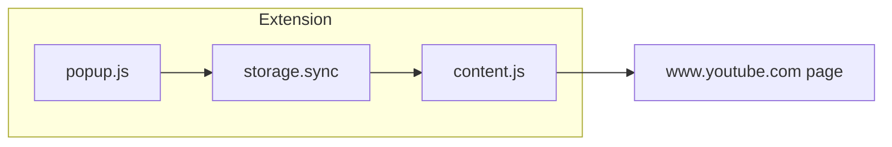

# Agent guide (maintainers & AI assistants)

This document orients anyone (including automated coding agents) who opens this repository so work can continue without rediscovering context.

## Purpose

**Say No to YouTube Shorts** is a Web Extension that reduces Shorts-related UI on **desktop** `https://www.youtube.com/*` and `https://youtube.com/*` (with or without `www`): sidebar Shorts entry, reel/shelf rows, sections titled “Shorts”, and Shorts tabs/chips. It does **not** change YouTube servers; it only adjusts the DOM/CSS in the user’s tab via a **Manifest V3** content script and bundled CSS.

Human-facing overview: [README.md](README.md). Chrome Web Store–oriented notes: [docs/store-listing.md](docs/store-listing.md).

## Repository map

| Path | Role |
|------|------|
| [manifest.json](manifest.json) | MV3 manifest: permissions, matches, content scripts, action popup, icons, Firefox `browser_specific_settings`. |
| [icons/](icons/) | Toolbar/store icons (`icon16.png`, `icon48.png`, `icon128.png`). Regenerate with [scripts/generate-icons.ps1](scripts/generate-icons.ps1). |
| [src/content/content.js](src/content/content.js) | Loads settings, sets `data-sntys-*` on `<html>`, applies `sntys-force-hide`, injects fallback `<style>`, marks DOM for JS-only rules, `MutationObserver` + debounced refresh, listens for storage changes (any storage area). |
| [src/content/styles.css](src/content/styles.css) | Static CSS keyed off `documentElement.dataset`; hides sidebar/reel/tabs where selectors allow. |
| [src/popup/popup.html](src/popup/popup.html) | Toolbar popup UI (checkboxes). |
| [src/popup/popup.js](src/popup/popup.js) | Reads/writes settings to `storage.sync`. |
| [src/popup/popup.css](src/popup/popup.css) | Popup styling. |

There is **no** background service worker; all behavior is content script + popup.

## Architecture (runtime)



1. User opens popup and toggles checkboxes → values stored in **`storage.sync`** (browser sync when the user has account sync enabled; otherwise local profile behavior per engine).
2. Content script reads settings on load, mirrors them to **`document.documentElement.dataset`** as `data-sntys-hide-sidebar`, `data-sntys-hide-reel`, `data-sntys-hide-rich`, `data-sntys-hide-nav` (`"1"` / `"0"`).
3. [styles.css](src/content/styles.css) uses those flags to hide elements (plus `:has()` where supported).
4. **JS tagging** fills gaps CSS cannot express reliably: rich sections whose title text is “Shorts” get class `sntys-shorts-heading`; ambiguous Shorts **chips** get `sntys-shorts-chip`.
5. **`applyForceHides()`** adds class `sntys-force-hide` on matched hosts (`ytd-reel-shelf-renderer`, guide rows with Shorts links, etc.) so hiding still applies if static CSS loses the cascade; a **fallback `<style>`** injected once carries the same rules.
6. **MutationObserver** on `document.documentElement` + `requestAnimationFrame` debounce rescans after YouTube’s SPA swaps the DOM.

## Troubleshooting (“nothing happens” on YouTube)

Use this order before changing selectors:

1. **Confirm the URL pattern** — The extension only runs on `https://www.youtube.com/*` and `https://youtube.com/*`. It does **not** run on `music.youtube.com`, embedded players on other sites, or non-HTTPS URLs.

2. **Reload the extension** after pulling code changes (Chromium: extensions page → Reload; Firefox: remove temporary add-on and load `manifest.json` again, or use “Reload” if shown).

3. **Verify the content script ran** — Open DevTools → **Console** on a YouTube tab. Run:
   - `document.documentElement.dataset.sntysHideReel` — expect `"1"` when hiding is enabled (default).
   - If these attributes are missing entirely, the content script did not inject (wrong origin, disabled extension, or console errors on load).

4. **Enable debug logging** — In the **same tab’s** console:
   ```js
   sessionStorage.setItem("sntys_debug", "1");
   location.reload();
   ```
   Then look for `[say-no-to-yt-shorts]` logs (dataset flags, reel/guide counts). Clear with `sessionStorage.removeItem("sntys_debug")`.

5. **Inspect for errors** — Red errors mentioning `storage`, `permissions`, or the script path mean the extension context failed before hid logic runs.

6. **DOM drift** — If attributes are `"1"` but Shorts remain visible, YouTube may have renamed nodes (e.g. home Shorts moved from `ytd-reel-shelf-renderer` to `ytd-rich-shelf-renderer[is-shorts]`). Capture **Inspect** → outer HTML for the Shorts block (or the left nav Shorts row) and update selectors in [content.js](src/content/content.js) / [styles.css](src/content/styles.css). A captured page dump may live under `docs/` for comparison (large files—grep for `is-shorts`, `shorts`).

## Settings schema (`chrome.storage.sync` / `browser.storage.sync`)

Flat keys (booleans; default **true** = hide):

| Key | Meaning |
|-----|---------|
| `hideSidebarShorts` | Sidebar + mini-guide entries, `/feed/shorts`, and guide-column chip/tab controls (HOME \| Shorts) linking or labeled as Shorts |
| `hideReelShelf` | `ytd-reel-shelf-renderer` and `ytd-rich-shelf-renderer[is-shorts]` (newer home Shorts row) |
| `hideRichShortsSections` | `ytd-rich-section-renderer` whose title reads as Shorts |
| `hideNavigationShorts` | Shorts tabs, href-based chips, text-tagged chips |

Changing any key must keep [content.js](src/content/content.js), [styles.css](src/content/styles.css), [popup.html](src/popup/popup.html), and [popup.js](src/popup/popup.js) in sync (same keys, defaults).

## Cross-browser API usage

Scripts use **`const ext = globalThis.browser ?? globalThis.chrome`** then **`ext.storage`** so the same files run on **Chromium** (Chrome, Edge, …) and **Firefox**. Do not assume `chrome` alone exists in every engine’s content script/popup context.

## How to run & test

### Chromium (Chrome / Edge)

1. `chrome://extensions` → Developer mode → **Load unpacked** → select repo root (folder containing `manifest.json`).
2. Open [YouTube](https://www.youtube.com), exercise home, subscriptions, a channel with a Shorts tab.
3. After code changes: **Reload** the extension on the extensions page.

### Firefox (desktop)

1. `about:debugging#/runtime/this-firefox` → **Load Temporary Add-on** → choose `manifest.json` in this repo.
2. Same YouTube smoke test. **Note:** Temporary add-ons are removed when Firefox closes unless you package/sign for permanent install ([addons.mozilla.org](https://addons.mozilla.org/) flow).

Firefox includes `browser_specific_settings.gecko` in [manifest.json](manifest.json) for packaging; the `id` may be replaced before AMO submission if you use an add-on–generated ID.

## When YouTube breaks the extension

YouTube changes class names and structure often. Typical workflow:

1. Reproduce on a logged-in (or logged-out) session; open DevTools on the broken control.
2. Prefer **CSS** + `data-sntys-*` + `:has()` in [styles.css](src/content/styles.css) when the target is stable.
3. Use **JS** in [content.js](src/content/content.js) when you need text content or ambiguous chips (follow existing `markRichShortsSections` / `markShortsChips` patterns).
4. Avoid hiding broad selectors (e.g. every `a[href*="/shorts"]`) without scoping—can break legitimate mixed pages.

Namespace new classes with the `sntys-` prefix to avoid collisions.

## Constraints (do not regress without intent)

- **Permissions:** Keep `host_permissions` limited to YouTube origins unless there is a clear feature need.
- **Privacy:** No remote code execution, no undisclosed telemetry; if you add network or analytics, update [README.md](README.md) and [docs/store-listing.md](docs/store-listing.md).
- **Payload:** Avoid heavy frameworks in the content script; keep observers debounced.

## Shipping

- Bump `version` in [manifest.json](manifest.json).
- Zip the extension **root contents** for store upload (include `manifest.json`, `icons/`, `src/`). See [README.md](README.md).

## Product / scope reminders

- **Primary:** Desktop web at `https://www.youtube.com/*` and `https://youtube.com/*`.
- **Android Chrome:** Not a Web Extension install target like desktop.
- **Firefox Android:** Separate, curated listing process; do not assume this repo ships there without extra work.

Original brainstorming file: [planning.md](planning.md) (historical context only).
