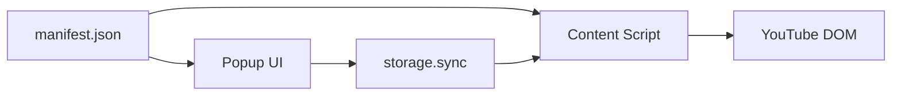
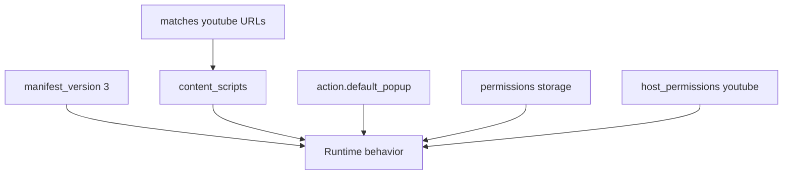
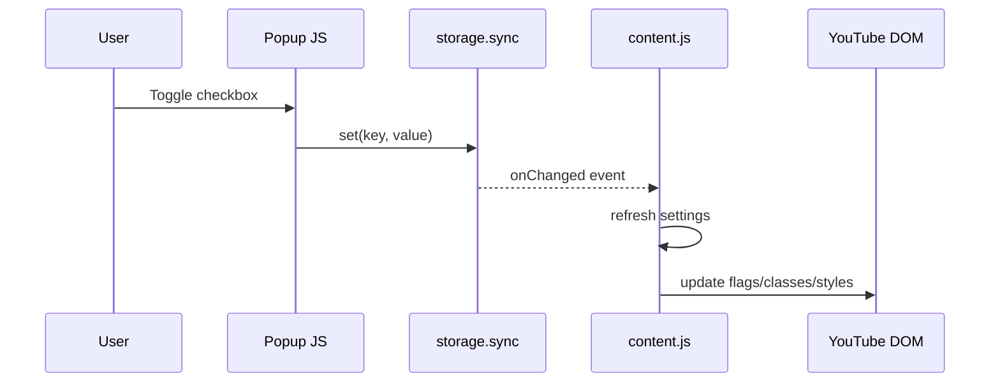
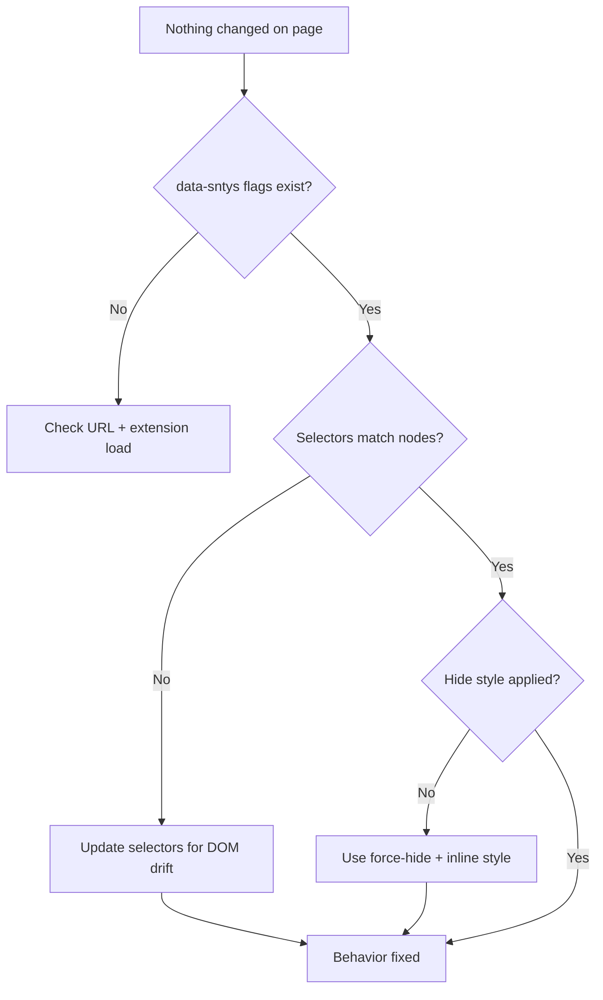

# Browser Extensions: Debrief and Lesson Plan

This document is a practical "how it works" guide for browser extensions, using this repository as a real example.

It is written for maintainers who may rely heavily on AI and want to understand the architecture and decisions behind the code.

## 1) What a browser extension is

A browser extension is a packaged application that runs inside the browser and can:

- add UI (toolbar icon, popup, options pages)
- read or modify web pages (via content scripts and CSS)
- store user preferences
- integrate with browser APIs (tabs, storage, context menus, etc., depending on permissions)

For this project, the extension's job is simple: hide Shorts-related UI on YouTube pages.

## 2) Core moving parts (conceptual model)

At a high level:

1. `manifest.json` declares what the extension is and what it can do.
2. A content script runs on matching pages (`youtube.com`) and changes DOM/CSS.
3. A popup lets the user toggle features.
4. Settings are persisted in extension storage.

You can think of this as:

- **manifest = contract**
- **content script = page behavior**
- **popup = user controls**
- **storage = state memory**

Visual model:



## 3) Manifest V3 basics

The extension uses **Manifest V3 (MV3)**. Important ideas:

- MV3 is the current extension platform for Chrome and modern Chromium ecosystems.
- Permissions are explicit; least-privilege is best.
- Content scripts are declared per URL match pattern.

In this repo, `manifest.json` sets:

- `host_permissions` to YouTube origins only
- `permissions` with `storage`
- `content_scripts` with:
  - `matches`: `https://www.youtube.com/*` and `https://youtube.com/*`
  - CSS: `src/content/styles.css`
  - JS: `src/content/content.js`
- `action.default_popup`: `src/popup/popup.html`
- `icons`: 16, 48, 128
- Firefox metadata under `browser_specific_settings.gecko`

Takeaway: the manifest is your extension's security and wiring blueprint.

Manifest-to-runtime map:



## 4) Content script fundamentals

The content script is injected into matching pages and runs in an extension-isolated JS context, but can still manipulate the page DOM.

In this project, `src/content/content.js` does three main things:

1. Loads settings from `storage.sync`
2. Reflects settings onto `<html>` as `data-sntys-*` attributes
3. Applies hide logic by:
   - adding marker classes (`sntys-shorts-heading`, `sntys-shorts-chip`, `sntys-force-hide`)
   - applying forced hides (including inline `display: none !important`)
   - rescanning after YouTube SPA DOM updates via `MutationObserver` + `requestAnimationFrame` debounce

Why this pattern works:

- CSS is fast and simple for stable selectors.
- JS fills gaps where text interpretation or dynamic node tagging is needed.
- YouTube is an SPA, so one-time DOM handling is not enough.

Content-script lifecycle:

```mermaid
flowchart LR
  load[Tab loads youtube.com]
  init[init()]
  read[Read storage defaults+saved]
  flags[Set data-sntys-* flags]
  mark[Mark shorts nodes/classes]
  hide[Apply force hides]
  observe[MutationObserver active]
  refresh[Debounced refresh]

  load --> init --> read --> flags --> mark --> hide --> observe --> refresh
```

## 5) CSS strategy in extensions

`src/content/styles.css` uses selectors keyed off `data-sntys-*` flags on `<html>`.

Example strategy:

- `data-sntys-hide-sidebar="1"` controls sidebar hiding
- `data-sntys-hide-reel="1"` controls home Shorts shelf hiding
- `data-sntys-hide-rich="1"` controls rich sections tagged as Shorts
- `data-sntys-hide-nav="1"` controls tabs/chips

Important real-world lesson:

- Site CSS (especially Web Components/Polymer host rules) can sometimes override extension styles.
- This project adds JS fallback force-hide behavior (`sntys-force-hide` + inline style) to improve reliability.

## 6) Popup and settings flow

`src/popup/popup.html` + `src/popup/popup.js` provide checkboxes for user preferences.

Data flow:

1. Popup reads settings from storage.
2. User toggles a checkbox.
3. Popup writes updated key to storage.
4. Content script listens to storage changes and updates page behavior in real time.

This decoupled flow is a standard extension pattern and scales well.

Popup-to-page sync flow:



## 7) Cross-browser compatibility (Chrome + Firefox)

Different browsers expose extension APIs differently:

- Chromium: `chrome.*`
- Firefox: `browser.*`

This repo uses:

```js
const ext = globalThis.browser ?? globalThis.chrome;
```

Then references `ext.storage...` so the same code runs across engines with minimal branching.

## 8) Debugging extensions in practice

Extension debugging has three layers:

1. **Injection check**
   - Confirm URL matches manifest pattern.
   - Confirm content script actually loaded.
   - In this project: check `document.documentElement.dataset.sntysHideReel`.

2. **Logic check**
   - Verify settings values.
   - Verify selectors find expected elements.
   - In this project: enable debug logs using:
     - `sessionStorage.setItem("sntys_debug", "1")`

3. **DOM drift check**
   - If app UI changed, old selectors may stop matching.
   - Capture real DOM via Inspect and update selectors/marking logic.

This is a core maintenance reality for UI-targeting extensions.

Debug decision tree:



## 9) Security and privacy principles

Key extension hygiene rules:

- Scope host permissions narrowly.
- Avoid remote code injection.
- Be transparent about what data is stored and where.
- Keep runtime behavior deterministic and auditable.

This project follows those principles by storing only UI preference booleans and limiting host permissions to YouTube.

## 10) Packaging and release basics

Typical release loop:

1. Update code and test manually.
2. Bump `version` in `manifest.json`.
3. Package extension files for store upload.
4. Publish listing updates if behavior/permissions changed.

For Firefox temporary local testing, load `manifest.json` from `about:debugging`.

## 11) Project-specific map (what was set up here)

- **Manifest wiring:** done
- **Popup with 4 toggles:** done
- **Storage persistence:** done
- **DOM/CSS hide logic for Shorts surfaces:** done
- **SPA resilience via observer:** done
- **Fallback force-hide path:** done
- **Cross-browser API handling:** done
- **AI maintainer guide (`AGENTS.md`):** done

## 12) General takeaways you should keep

1. Extension development is mostly disciplined wiring + DOM strategy, not magic.
2. Stable behavior comes from combining CSS and JS, not relying on one only.
3. The manifest is as important as runtime code.
4. SPA sites require continuous re-evaluation of DOM, not one-time manipulation.
5. "Works today" on a fast-moving site means "maintain selectors over time."
6. For AI-first projects, explicit docs (like this and `AGENTS.md`) are part of the product, not optional extras.

---

If you want a follow-up, we can add a second doc that is purely "build your first extension from scratch in 60 minutes" using this repo as the final stage.
